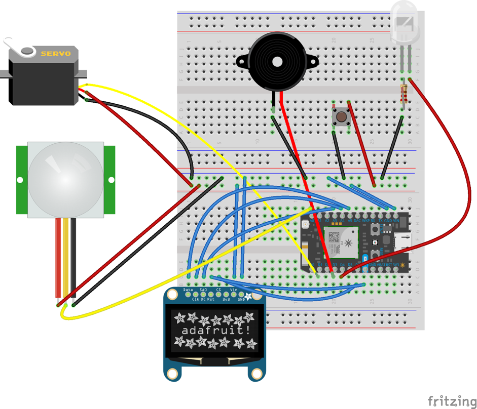

<h1>Smart mousetrap guide</h1>
<h2>Circuit diagram:</h2>
Connect all the hardware needed as shown in following image:

Note:
Servo needs to connected to pins that allow analog
Piezo buzzer needs to be connected to pins that allow PWM.

<h2>Software needs:</h2>

Register Particle:
1. We'll be using the Particle Photon as our embedded device. Create an account using the following link: https://login.particle.io/signup?redirect=https%3A//www.particle.io/ 

Configure the Photon: 
Mobile App approach:
Download the App:  iOS (Links to an external site.)Links to an external site. or Android (Links to an external site.)Links to an external site.
Be sure your Phone is connected to a network (Wi-Fi).
Start the Particle App
Plug in the USB cable to your computer and the Photon.  It should enter "Listening Mode", where the  light should be blinking blue. If not, hold the SETUP button for 3 seconds. (This is also how you'd add a new Wi-Fi location, like an access point home/apartment/dorm)
The initial screen on the app will allow you login to the account your created earlier (or create one if you skipped that step)
The next screen will allow you to add a device to your account. Select “Photon” from the menu to add your Photon.
Next you will need to connect directly to the Photon via Wi-Fi (and disconnect from whatever Wi-Fi network you’re connected to). You will need to go to your phone’s settings and search for available access points (i.e., leave the Photon app). Your Photon will be advertising with the name “Photon-XXXX”, where the “XXXX” is based on the four letters from the bar code. Select your Photon.
Once connected to your Photon, return to the Particle App.
If asked, select “Yes” when asked if you want to claim ownership.
The Particle app will complete connecting to your device and allow you to select the Wi-Fi network it should connect to. Select wustl-guest-2.0 (no authentication)
You may be asked to pick a name for the Photon. It defaults to a name based on two randomly chosen words. Feel free to change it to anything you’d like.
Configuration of the Photon should complete and your phone will disconnect from the Photon and re-connect to the Wi-Fi network.
After this the Photon will connect directly to the Wi-Fi network.

Use Particle.io to write code to control hardware. Particle Functions (the API functions on the Photon) can be passed values (in a String) and/or return a value. They can send information to the Photon. They can command the Photon to do an action/run other code.

Use Particle’s JavaScriptAPI: https://docs.particle.io/reference/javascript/ and HTML to implement a website. Most Particle API functions return a type of object known as a promise. The methods return immediately (non-blocking) rather than wait for the an operation to complete and the "promise" is used to handle processing of the results when they are available. Cloud function can be called through UI to control hardware.

<h2>Phone Gap</h2>

PhoneGap:
1. Install the PhoneGap desktop app (Links to an external site.)Links to an external site. on your computer
2. Install the PhoneGap Mobile App (Links to an external site.)Links to an external site. on your Phone/Tablet
3. Open the PhoneGap desktop App
4. Download sample project from this link: https://wustl.instructure.com/courses/64/files/9949/download?verifier=X9hVafPVSE2M99tK5PmIyBUmCpH8X6HDx67BWmXp&wrap=1
5. Change configure.xml to “Smart Mouse Trap” and swap your www/index.html code and www/js/index.js code to the above html and js files.
6. Add the website resulting folder to PhoneGap Desktop App via the "+" button
7. Preview your app: http://docs.phonegap.com/getting-started/4-preview-your-app/desktop/
8. Use Particle account and password to login.

<h2>Demo</h2>

